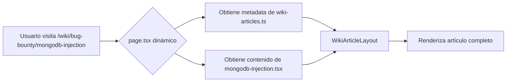

# ARQUITECTURA DATA-DRIVEN DE LA WIKI

## 📋 Resumen

La Wiki de Aitana.cloud utiliza una **arquitectura data-driven completamente desacoplada** donde:

- ✅ **Metadata centralizada** en un solo archivo
- ✅ **Contenido separado** en archivos individuales por artículo
- ✅ **Una sola página dinámica** renderiza todos los artículos
- ✅ **Sin hardcoding** de contenido en código TSX
- ✅ **Fácil escalabilidad** para agregar nuevos artículos

## 🏗️ Estructura del Proyecto

```
src/
├── data/
│   ├── wiki-articles.ts           # ← METADATA de todos los artículos (60+)
│   └── wiki-article-contents.tsx  # ← MAPA que conecta IDs con archivos
│
├── content/
│   └── wiki/
│       ├── fundamentos/
│       │   ├── http-basico.tsx
│       │   ├── cookies-sessions.tsx
│       │   └── ... (14 más)
│       │
│       ├── vulnerabilidades/
│       │   ├── sql-injection.tsx
│       │   ├── xss.tsx
│       │   └── ... (7 más)
│       │
│       ├── bug-bounty/             # ← 35 ARTÍCULOS BUG BOUNTY
│       │   ├── sql-injection-avanzada.tsx     ← ✅ CREADO
│       │   ├── mongodb-injection.tsx          ← ✅ CREADO
│       │   ├── redis-rce.tsx                  ← ⏳ Pendiente (33 más)
│       │   ├── cassandra-injection.tsx
│       │   ├── homograph-attacks.tsx
│       │   └── ...
│       │
│       ├── defensas/
│       │   └── ...
│       │
│       └── herramientas/
│           └── ...
│
├── components/
│   ├── WikiArticleLayout.tsx      # ← Layout profesional reutilizable
│   └── WikiArticleComponents.tsx  # ← 15+ componentes (Section, CodeBlock, etc.)
│
└── app/[locale]/wiki/
    └── [category]/
        └── [slug]/
            └── page.tsx           # ← UNA SOLA PÁGINA para TODOS los artículos
```

## 🔄 Flujo de Renderizado



### Paso a Paso

1. **Usuario visita**: `/es/wiki/bug-bounty/mongodb-injection`

2. **Next.js matchea** la ruta dinámica: `[category]/[slug]/page.tsx`
   - `category = "bug-bounty"`
   - `slug = "mongodb-injection"`

3. **page.tsx ejecuta**:
   ```typescript
   const article = getArticleBySlug('mongodb-injection');
   // Retorna metadata: title, description, level, tags, etc.
   
   const ContentComponent = articleContentMap['mongodb-injection'];
   // Retorna el componente que renderiza el contenido
   ```

4. **Renderiza**:
   ```tsx
   <WikiArticleLayout {...article}>
     <ContentComponent locale="es" />
   </WikiArticleLayout>
   ```

## 📄 Archivos Clave

### 1. `src/data/wiki-articles.ts` - Metadata Centralizada

```typescript
export interface WikiArticle {
  id: string;                    // 'mongodb-injection'
  slug: string;                  // 'mongodb-injection' (URL-friendly)
  category: 'fundamentos' | 'vulnerabilidades' | 'defensas' | 'herramientas' | 'bug-bounty';
  title: string;                 // 'MongoDB Operator Injection'
  description: string;           // 'Explotando operadores NoSQL...'
  level: 'Estudiante' | 'Junior Developer' | 'Pentester' | 'Security Expert';
  readTime: string;              // '20 minutos'
  lastUpdated: string;           // 'Enero 2026'
  cvssScore?: number;            // 8.9
  tags: string[];                // ['NoSQL', 'MongoDB', 'Bug Bounty']
  relatedArticles?: string[];    // ['sql-injection-avanzada', 'redis-rce']
  categoryColor: 'blue' | 'red' | 'green' | 'purple' | 'orange';
}

export const bugBountyArticles: WikiArticle[] = [
  {
    id: 'mongodb-injection',
    slug: 'mongodb-injection',
    category: 'bug-bounty',
    title: 'MongoDB Operator Injection',
    description: 'Explotando operadores NoSQL para bypass de autenticación...',
    level: 'Pentester',
    readTime: '20 minutos',
    lastUpdated: 'Enero 2026',
    cvssScore: 8.9,
    tags: ['NoSQL', 'MongoDB', 'Operator Injection', 'Bug Bounty'],
    relatedArticles: ['sql-injection-avanzada', 'redis-rce'],
    categoryColor: 'orange'
  },
  // ... 34 artículos más
];
```

**Beneficio**: Un solo lugar para actualizar metadata de todos los artículos.

---

### 2. `src/content/wiki/bug-bounty/mongodb-injection.tsx` - Contenido del Artículo

```typescript
import { ReactNode } from 'react';
import {
  Section,
  Subsection,
  Paragraph,
  CodeBlock,
  AlertDanger,
  // ... más componentes
} from '@/components/WikiArticleComponents';

export default function MongodbInjectionContent({ 
  locale 
}: { 
  locale: string 
}): ReactNode {
  return (
    <>
      <Section id="introduccion" title="NoSQL ≠ Seguro">
        <Paragraph>
          Muchos desarrolladores creen que MongoDB es inmune...
        </Paragraph>
        
        <CodeBlock
          language="javascript"
          title="Código vulnerable"
          code={`db.collection('users').findOne({
  username: username,  // ⚠️ VULNERABLE
  password: password
});`}
        />
      </Section>

      <Section id="explotacion" title="Explotación">
        <Paragraph>Un atacante puede inyectar operadores...</Paragraph>
      </Section>
    </>
  );
}
```

**Beneficio**: Cada artículo es independiente y fácil de editar.

---

### 3. `src/data/wiki-article-contents.tsx` - Mapa de Contenidos

```typescript
import SqlInjectionAvanzadaContent from '@/content/wiki/bug-bounty/sql-injection-avanzada';
import MongodbInjectionContent from '@/content/wiki/bug-bounty/mongodb-injection';
// ... más imports

export const articleContentMap: Record<string, ArticleContentFunction> = {
  'sql-injection-avanzada': SqlInjectionAvanzadaContent,
  'mongodb-injection': MongodbInjectionContent,
  // ... 33 artículos más
};
```

**Beneficio**: Conexión simple entre ID y archivo de contenido.

---

### 4. `src/app/[locale]/wiki/[category]/[slug]/page.tsx` - Página Dinámica

```typescript
export async function generateStaticParams() {
  // Genera TODAS las rutas posibles en build time (SSG)
  return allArticles.map((article) => ({
    category: article.category,
    slug: article.slug,
  }));
}

export default function WikiArticlePage({ params }: { params: { slug: string, locale: string } }) {
  // 1. Obtener metadata
  const article = getArticleBySlug(params.slug);
  
  // 2. Obtener componente de contenido
  const ContentComponent = articleContentMap[article.id];
  
  // 3. Renderizar
  return (
    <WikiArticleLayout {...article}>
      <ContentComponent locale={params.locale} />
    </WikiArticleLayout>
  );
}
```

**Beneficio**: Un solo archivo maneja todos los artículos. No hay duplicación.

---

## 🆕 Cómo Agregar un Nuevo Artículo

### Paso 1: Crear el Archivo de Contenido

`src/content/wiki/bug-bounty/redis-rce.tsx`:

```typescript
import { ReactNode } from 'react';
import { Section, Paragraph, CodeBlock } from '@/components/WikiArticleComponents';

export default function RedisRCEContent({ locale }: { locale: string }): ReactNode {
  return (
    <>
      <Section id="intro" title="Redis RCE via Lua Sandboxing">
        <Paragraph>
          Redis permite ejecutar scripts Lua, pero el sandbox tiene vulnerabilidades...
        </Paragraph>
        
        <CodeBlock
          language="lua"
          code={`redis.call('eval', 'os.execute("whoami")', 0)`}
        />
      </Section>
    </>
  );
}
```

### Paso 2: Agregar Metadata

En `src/data/wiki-articles.ts`:

```typescript
export const bugBountyArticles: WikiArticle[] = [
  // ... artículos existentes
  {
    id: 'redis-rce',
    slug: 'redis-rce',
    category: 'bug-bounty',
    title: 'Redis RCE via Lua Sandboxing',
    description: 'Escapando el sandbox de Lua en Redis para ejecución remota de código',
    level: 'Security Expert',
    readTime: '30 minutos',
    lastUpdated: 'Enero 2026',
    cvssScore: 9.6,
    tags: ['Redis', 'RCE', 'Lua', 'Sandbox Escape'],
    relatedArticles: ['mongodb-injection', 'cassandra-injection'],
    categoryColor: 'orange'
  }
];
```

### Paso 3: Registrar en el Mapa

En `src/data/wiki-article-contents.tsx`:

```typescript
import RedisRCEContent from '@/content/wiki/bug-bounty/redis-rce';

export const articleContentMap = {
  // ... artículos existentes
  'redis-rce': RedisRCEContent,
};
```

### Paso 4: ¡Listo! 🎉

- La ruta `/wiki/bug-bounty/redis-rce` estará automáticamente disponible
- Next.js generará la página estática en build time
- SEO metadata automático desde `wiki-articles.ts`

---

## ✅ Ventajas de esta Arquitectura

### 1. **Escalabilidad**
- Agregar 1 artículo = 3 cambios simples (archivo + metadata + mapa)
- No hay duplicación de código
- No hay conflictos de merge entre colaboradores

### 2. **Mantenibilidad**
- Cambiar diseño global → editar solo `WikiArticleLayout.tsx`
- Actualizar metadata de artículo → editar solo `wiki-articles.ts`
- Cambiar contenido → editar solo `src/content/wiki/{category}/{slug}.tsx`

### 3. **Separación de Concerns**
- **Datos** (metadata) → `wiki-articles.ts`
- **Presentación** (layout) → `WikiArticleLayout.tsx` + `WikiArticleComponents.tsx`
- **Contenido** (texto/código) → `src/content/wiki/**/*.tsx`
- **Routing** → `page.tsx` dinámico

### 4. **Performance**
- **Static Site Generation (SSG)**: Next.js pre-renderiza todas las páginas en build
- **Fast page loads**: HTML estático + hidratación React
- **No fetching**: Todo compilado en build time

### 5. **DX (Developer Experience)**
- **TypeScript**: Type-safe metadata y props
- **IntelliSense**: Autocompletado en VS Code
- **Components**: Reutilización de UI (CodeBlock, AlertDanger, etc.)

---

## 📊 Comparación: Antes vs Después

### ❌ ANTES (Hardcoded)

```
src/app/[locale]/wiki/bug-bounty/
├── sql-injection-avanzada/
│   └── page.tsx (300 líneas hardcoded)
├── mongodb-injection/
│   └── page.tsx (300 líneas hardcoded)
├── redis-rce/
│   └── page.tsx (300 líneas hardcoded)
└── ... (32 archivos más)
    └── page.tsx (cada uno con contenido duplicado)
```

**Problemas**:
- 35 archivos casi idénticos
- Cambiar layout = editar 35 archivos
- Metadata duplicada en cada archivo
- Difícil colaboración (conflictos de merge)

### ✅ DESPUÉS (Data-Driven)

```
src/
├── data/
│   ├── wiki-articles.ts (metadata centralizada)
│   └── wiki-article-contents.tsx (mapa de imports)
├── content/wiki/bug-bounty/
│   ├── sql-injection-avanzada.tsx (solo contenido)
│   ├── mongodb-injection.tsx (solo contenido)
│   ├── redis-rce.tsx (solo contenido)
│   └── ... (32 más, cada uno independiente)
└── app/[locale]/wiki/[category]/[slug]/
    └── page.tsx (UN SOLO ARCHIVO dinámico)
```

**Beneficios**:
- 1 página dinámica renderiza todos los artículos
- Cambiar layout = editar 1 archivo
- Metadata centralizada
- Cada artículo es independiente (Git-friendly)

---

## 🔮 Futuro: Posibles Mejoras

### 1. **MDX en lugar de TSX**
Migrar contenido a `.mdx` para sintaxis Markdown:

```mdx
---
slug: mongodb-injection
---

# NoSQL ≠ Seguro

Muchos desarrolladores creen que MongoDB es inmune...

<CodeBlock language="javascript">
db.collection('users').findOne({ username, password });
</CodeBlock>
```

**Pros**: Más fácil de escribir, sintaxis familiar
**Contras**: Requiere configurar next-mdx-remote

### 2. **CMS Headless**
Usar Contentful, Sanity o Strapi para contenido:

```typescript
const content = await fetchFromCMS(params.slug);
```

**Pros**: UI de edición, multi-usuario, versionado
**Contras**: Dependencia externa, costo

### 3. **Base de Datos**
PostgreSQL + Prisma para almacenar contenido:

```typescript
const article = await prisma.article.findUnique({
  where: { slug: params.slug }
});
```

**Pros**: Búsqueda SQL, escalabilidad infinita
**Contras**: Complejidad, hosting DB

---

## 📝 Estado Actual

### ✅ Completado (2/35 artículos Bug Bounty)

1. **sql-injection-avanzada** ✅
   - Metadata: ✅
   - Contenido: ✅ (`src/content/wiki/bug-bounty/sql-injection-avanzada.tsx`)
   - 3 técnicas: Union-based, Error-based, Time-blind
   - Script Python de automatización
   - Tabla comparativa

2. **mongodb-injection** ✅
   - Metadata: ✅
   - Contenido: ✅ (`src/content/wiki/bug-bounty/mongodb-injection.tsx`)
   - Operadores peligrosos: $ne, $gt, $regex, $where
   - 3 ataques: Login bypass, Exfiltración con regex, RCE con $where
   - Código Python de explotación

### ⏳ Pendiente (33/35 artículos)

Todos tienen metadata definida en `wiki-articles.ts`, falta crear archivos de contenido:

- **Bases de Datos** (5 más):
  - redis-rce
  - cassandra-injection
  - sqlite-local-injection
  - firebase-misconfiguration
  - realm-coredata

- **Unicode/Alfabetos** (5):
  - homograph-attacks
  - unicode-normalization
  - utf8-smuggling
  - sqli-small-windows
  - multi-stage-payload

- **SSRF** (4):
  - cloud-metadata-ssrf
  - dns-rebinding
  - gopher-protocol
  - ssrf-pdf-renderers

- **IA Móvil** (5):
  - prompt-injection-mobile
  - coreml-hijacking
  - app-intents-abuse
  - intent-injection-gemini
  - npu-sidechannel

- **Certificados** (4):
  - ssl-pinning-bypass
  - broken-cert-validation
  - mitm-non-http
  - ct-log-monitoring

- **Criptografía** (5):
  - broken-integrity-checks
  - insecure-key-storage
  - weak-cryptography
  - crypto-sidechannel
  - whitebox-crypto-re

- **Lógica de Negocio** (4):
  - idor
  - race-conditions
  - jwt-attacks
  - oauth-misconfigurations

---

## 🎯 Conclusión

La nueva arquitectura es **100% escalable, mantenible y Git-friendly**:

✅ **Metadata centralizada** → Un solo archivo  
✅ **Contenido separado** → Un archivo por artículo  
✅ **Una página dinámica** → Renderiza todos los artículos  
✅ **Sin hardcoding** → Fácil actualización  
✅ **TypeScript** → Type-safe  
✅ **SSG** → Super rápido  

**Agregar un artículo nuevo = 3 pasos simples** 🚀
